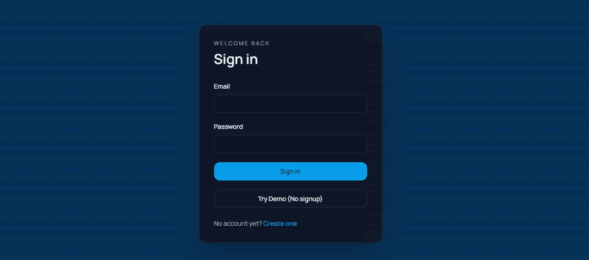
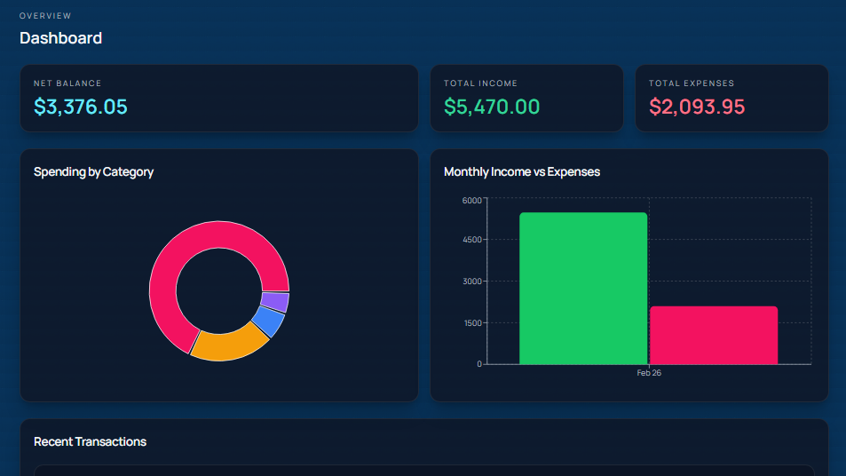
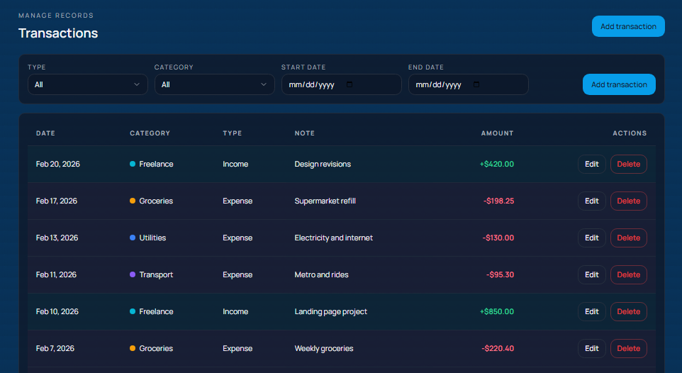
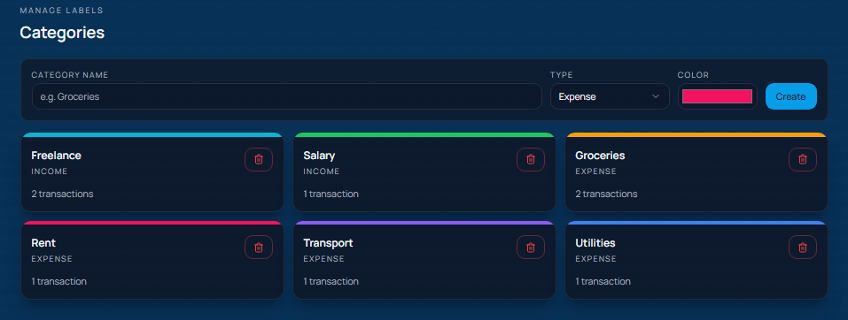

# Personal Finance Tracker

Production-style full-stack personal finance tracker built with FastAPI, PostgreSQL, SQLAlchemy (async), and React + TypeScript.

## Features

- JWT auth: register, login, refresh
- Demo mode login (`Try Demo`) with seeded sample data
- Dashboard with net/income/expense cards, category donut chart, monthly bar chart, recent transactions
- Transactions page with filters, pagination, create/edit modal, delete actions
- Categories page with create/delete and transaction counts
- Reports page with date range filters, summary cards, charts, CSV export
- Light/Dark theme toggle with persisted preference
- Async backend architecture with Alembic migrations
- Endpoint test suite using pytest + httpx

## Tech Stack

### Backend

- FastAPI
- PostgreSQL
- SQLAlchemy 2 (async)
- Alembic
- python-jose + passlib
- Pydantic v2
- pytest + httpx

### Frontend

- React 18 + Vite + TypeScript
- Tailwind CSS
- shadcn/ui-compatible setup
- TanStack Query
- React Hook Form + Zod
- Recharts
- React Router v6
- Axios

## Project Structure

```text
project-root/
├── backend/
│   ├── app/
│   │   ├── core/
│   │   ├── models/
│   │   ├── routers/
│   │   ├── schemas/
│   │   ├── services/
│   │   └── tests/
│   ├── alembic/
│   ├── alembic.ini
│   └── requirements.txt
├── frontend/
│   ├── src/
│   │   ├── api/
│   │   ├── components/
│   │   ├── hooks/
│   │   ├── pages/
│   │   ├── store/
│   │   ├── types/
│   │   └── utils/
│   └── package.json
├── docs/
│   └── screenshots/
├── docker-compose.yml
└── README.md
```

## Getting Started

### Prerequisites

- Docker + Docker Compose
- Optional for local (non-Docker) run:
  - Python 3.12+
  - Node.js 20+

### Environment Files

Already present in this repo:

- `backend/.env`
- `frontend/.env`

If needed, reset from examples:

```cmd
copy backend\.env.example backend\.env /Y
copy frontend\.env.example frontend\.env /Y
```

## Run with Docker (Recommended)

1. Start containers:

```cmd
docker compose up -d --build
```

2. Apply database migrations:

```cmd
docker compose exec backend alembic upgrade head
```

If `alembic` CLI is not available in container PATH, use:

```cmd
docker compose exec backend python -c "from alembic.config import main; main(argv=['-c','alembic.ini','upgrade','head'])"
```

3. Open apps:

- Frontend: `http://localhost:5173`
- Backend API: `http://localhost:8000`
- API docs: `http://localhost:8000/docs`

Stop stack:

```cmd
docker compose down
```

## Run Locally (Without Docker)

### Backend

```cmd
cd backend
python -m venv .venv
.\.venv\Scripts\activate.bat
pip install -r requirements.txt
alembic upgrade head
uvicorn app.main:app --reload --host 0.0.0.0 --port 8000
```

### Frontend

```cmd
cd frontend
npm install
npm run dev
```

## Tests

Run backend endpoint tests:

```cmd
pytest backend/app/tests -q
```

If dependencies are missing in your interpreter, install backend requirements first:

```cmd
cd backend
pip install -r requirements.txt
```

## Demo Mode

- Login page includes `Try Demo (No signup)`.
- Backend seeds a demo user, categories, and transactions on startup when `DEMO_MODE=true`.

Demo env variables:

- `DEMO_MODE=true`
- `DEMO_USER_NAME=Demo User`
- `DEMO_USER_EMAIL=demo@pftracker.app`
- `DEMO_USER_PASSWORD=Demo@12345`

## API Endpoints

### Auth

- `POST /auth/register`
- `POST /auth/login`
- `POST /auth/refresh`
- `POST /auth/demo`

### Categories

- `POST /categories`
- `GET /categories`
- `DELETE /categories/{id}`

### Transactions

- `POST /transactions`
- `GET /transactions`
- `GET /transactions/{id}`
- `PUT /transactions/{id}`
- `DELETE /transactions/{id}`

### Reports

- `GET /reports/summary`
- `GET /reports/by-category`
- `GET /reports/monthly`

## Screenshots

Add screenshots under `docs/screenshots/` with these names:

- `docs/screenshots/login.png`
- `docs/screenshots/dashboard.png`
- `docs/screenshots/transactions.png`
- `docs/screenshots/categories.png`
- `docs/screenshots/reports.png`

Example markdown:

```md





```

## Push To GitHub

From project root (`cmd`):

```cmd
git init
git add .
git commit -m "Initial production-ready personal finance tracker"
git branch -M main
git remote add origin https://github.com/<your-username>/<your-repo>.git
git push -u origin main
```

If remote already exists:

```cmd
git remote set-url origin https://github.com/<your-username>/<your-repo>.git
git push -u origin main
```

## Notes

- Backend enforces user-level data isolation in service layer.
- Password hashes are never exposed in API responses.
- Current tests use async SQLite for isolation and include a compatibility shim for monthly report SQL behavior.
